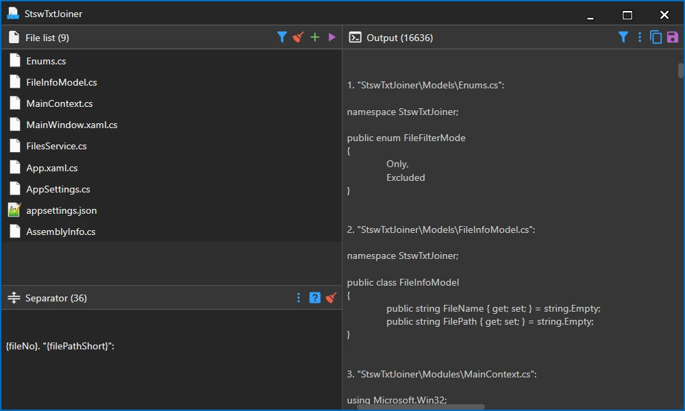

# StswFileJoiner

**StswFileJoiner** is a small Windows app for quickly joining multiple text files or images into one combined output.



It is useful when you want to merge Markdown files, JSON snippets, logs, notes, source-code fragments, configuration files, screenshots, sprites, scanned pages, or other text and image files without manually combining them one by one.

## Features

### Text joining

* Joins many text files into one output.
* Lets you add files manually or by drag & drop.
* Supports dropping whole folders and loading files recursively.
* Can filter files by extension.
* Allows custom separators between joined files.
* Supports separator placeholders such as file name, extension, number, and path.
* Shows a preview of the generated output.
* Can copy the result to the clipboard.
* Can save the result to a file.

### Image joining

* Joins multiple image files into one output image.
* Lets you add images manually or by drag & drop.
* Supports dropping whole folders and loading images recursively.
* Allows changing the order of images before joining them.
* Supports horizontal and vertical layouts.
* Supports grid layouts configured by column or row count.
* Can overlay images on top of one another.
* Allows transparent spacing between images.
* Preserves image transparency.
* Centers smaller images within rows, columns, and grid cells.
* Shows a preview when the generated image does not exceed the configured preview-size limit.
* Displays a message when the generated image is too large to preview.
* Can still save an image even when it is too large for the preview.
* Saves the generated image as PNG.

## Text joining example

You have several files:

```text
intro.md
chapter-1.md
chapter-2.md
summary.md
```

You add them to StswFileJoiner, set a separator, and generate one combined text file.

Example separator:

```text
--- {fileNo}. {fileName}.{fileExt} ---
```

Result:

```text
--- 1. intro.md ---
Content of intro.md

--- 2. chapter-1.md ---
Content of chapter-1.md

--- 3. chapter-2.md ---
Content of chapter-2.md

--- 4. summary.md ---
Content of summary.md
```

## Separator placeholders

You can use these placeholders in the separator text:

| Placeholder       | Meaning                     |
| ----------------- | --------------------------- |
| `{fileName}`      | File name without extension |
| `{fileExt}`       | File extension              |
| `{fileNo}`        | File number on the list     |
| `{filePath}`      | Full file path              |
| `{filePathShort}` | Shorter relative file path  |

## Image joining modes

| Mode         | Description                                                               |
| ------------ | ------------------------------------------------------------------------- |
| `Horizontal` | Places images next to one another from left to right                      |
| `Vertical`   | Places images below one another from top to bottom                        |
| `Grid`       | Arranges images in a grid using the selected number of columns or rows    |
| `Overlay`    | Draws images on top of one another in their current list order            |

Transparent spacing can be added between images in the horizontal, vertical, and grid modes.

The output dimensions depend on the selected mode and the dimensions of the source images. Smaller images are centered within the available row, column, or grid cell space.

## File filters

The app can work in two filter modes:

| Mode       | Description                              |
| ---------- | ---------------------------------------- |
| `Only`     | Adds only files with selected extensions |
| `Excluded` | Adds all files except selected extensions |

Default text extensions:

```text
.md, .json, .txt
```

Image files are filtered separately by the Image module.

You can change the filters in the app.

## Preview limits

Text output is shown directly in the preview panel.

Image output is previewed only when its total pixel count does not exceed the configured limit. This prevents very large generated images from consuming too much memory in the user interface.

An image that is too large to preview can still be generated and saved to disk.

## Download / installation

Download the latest release from the **Releases** section and run the application on Windows.

> Add release link here after publishing the first GitHub release.

## Build from source

Requirements:

* Windows
* .NET 8 SDK

Build:

```bash
dotnet build -c Release
```

Run:

```bash
dotnet run -c Release
```

Publish:

```bash
dotnet publish -c Release -r win-x64 --self-contained true
```

## Tech stack

* C#
* WPF
* .NET 8
* StswExpress